# AutoCI — Dev Progress Diagram

> **Purpose**: development-tracking diagram showing every node (UI, agent, route, table, external API, storage, deploy target) grouped logically, with status (✅ Done / ⚙️ In progress / 📋 TODO) and relative effort estimate per TODO node.
> **Update cadence**: every time a node moves status. Keep this open during work sessions.
> **Effort scale (project-scoped)**: XS / S / M / L / XL anchored to shipped work — see `memory/feedback_estimates.md` or the rubric in §3 below.
> **Companion docs**: `plan-of-record.md` (the plan) · `ROADMAP.md` (cuts + post-MVP wishlist).

---

## 1. Mermaid diagram

```mermaid
graph TB
    classDef done fill:#22c55e,stroke:#15803d,color:#fff,stroke-width:2px
    classDef wip fill:#fbbf24,stroke:#b45309,color:#000,stroke-width:2px
    classDef todo fill:#94a3b8,stroke:#475569,color:#fff,stroke-width:2px
    classDef todoBig fill:#ef4444,stroke:#7f1d1d,color:#fff,stroke-width:2px

    subgraph FE [" 🖥️ Frontend (Next.js)"]
        FE_SHELL["3-tab shell + nav<br/>📋 [M]"]:::todo
        FE_DRAWER["Right drawer<br/>(React Flow, always-on)<br/>📋 [M]"]:::todo
        FE_CHAT["Chat tab<br/>📋 [S]"]:::todo
        FE_QTC["QueryTransformationCard<br/>📋 [S]"]:::todo
        FE_CITDR["CitationDrawer<br/>📋 [M]"]:::todo
        FE_KSP["KnowledgeSourcesPanel<br/>📋 [S]"]:::todo
        FE_CSEARCH["CandidateSearch tab<br/>📋 [M]"]:::todo
        FE_SLOT["SlotGrid<br/>(cal.com slots)<br/>📋 [M]"]:::todo
        FE_CIS["CIS tab<br/>(scope chat + tool select + run)<br/>📋 [M]"]:::todo
        FE_INTV["InterventionsTable<br/>(per + cross-Kaizen)<br/>📋 [S]"]:::todo
        FE_KPI["KPI tile row<br/>✅"]:::done
        FE_WRITEUP["Writeup card + chips<br/>✅ wave A"]:::done
        FE_ASK["Ask-mode UI<br/>✅ wave A"]:::done
        FE_SSE["SSE client<br/>✅"]:::done
        FE_RETIRE_KAN["Kanban (frontend)<br/>📋 retire [XS]"]:::todo
        FE_RETIRE_SD["/system-diagram page<br/>📋 retire [XS]"]:::todo
    end

    subgraph BE_ROUTES [" 🛣️ Backend Routes"]
        R_CHAT["/chat/query<br/>✅ (planner upgrade pending)"]:::done
        R_TRIG["/trigger/manual + /goal-review<br/>✅"]:::done
        R_STREAM["/sessions/{id}/stream<br/>✅"]:::done
        R_RESPOND["/sessions/{id}/respond<br/>✅"]:::done
        R_METRICS["/metrics/cost + /metrics/kpis<br/>✅"]:::done
        R_KNOW["/knowledge/seed + /knowledge/update<br/>✅"]:::done
        R_RAG["/rag/ingest<br/>✅"]:::done
        R_HEALTH["/health<br/>✅"]:::done
        R_SOURCES["/sources<br/>📋 [S]"]:::todo
        R_CAND["/candidates/search + /:id/cv + /:id/schedule<br/>📋 [M]"]:::todo
        R_CIS["/cis/scope + /cis/run<br/>📋 [M]"]:::todo
        R_INTV["/interventions<br/>📋 [S]"]:::todo
        R_INBOUND["/simulate-inbound<br/>📋 [S]"]:::todo
    end

    subgraph BE_SPEC [" 🧠 Backend Specialists"]
        S1_OLD["S1 TranslationAgent<br/>✅ (to be replaced)"]:::done
        S1_NEW["S1 QueryPlanner<br/>📋 [L]"]:::todoBig
        S2["S2 RAGAgent<br/>✅"]:::done
        S3_OLD["S3 SQLAgent<br/>✅ (to be refactored)"]:::done
        S3_NEW["S3 SQLExecutor<br/>📋 [S]"]:::todo
        SQL_TPL["sql_templates dict<br/>📋 [S]"]:::todo
        S4["S4 ResearchAgent<br/>(Tavily / News / Adzuna)<br/>✅"]:::done
    end

    subgraph BE_DET [" 🔎 Backend Detection"]
        D1["D1 InternalBenchmarking<br/>✅"]:::done
        D2["D2 ExternalBenchmarking<br/>✅ (incl. live salary signal)"]:::done
        D3["D3 GapAnalysis<br/>✅"]:::done
    end

    subgraph BE_CIS [" 🛠️ Backend CIS Tools"]
        K_SCOPE["K_SCOPING<br/>📋 [M]"]:::todo
        K_SEL["K_TOOL_SELECTOR<br/>📋 [S]"]:::todo
        K1["K1 Define<br/>✅"]:::done
        K2["K2 Measure<br/>✅"]:::done
        K3["K3 AnalyseHost<br/>✅"]:::done
        K4["K4 FiveWhys (RAG-grounded)<br/>✅"]:::done
        K5["K5 Ishikawa (RAG-grounded)<br/>✅"]:::done
        K6["K6 Improve (+ linked_root_cause)<br/>⚙️ [XS] update prompt"]:::wip
        K7_RET["K7 Control / Kanban<br/>📋 retire [XS]"]:::todo
        K_WRITE["K_WRITEUP<br/>✅"]:::done
        K_FMEA["FMEA agent + table<br/>📋 [M]"]:::todo
    end

    subgraph BE_TOOLS [" 🔧 Backend Tools / Middleware"]
        T1["T1 MCP Analytics<br/>✅"]:::done
        T2["T2 Validation Interceptor<br/>✅"]:::done
        T3["T3 LiteLLM Router (DeepSeek)<br/>✅ (USD pricing live)"]:::done
        T4["T4 Embeddings (OpenAI)<br/>✅"]:::done
    end

    subgraph BE_WF [" 🎼 Workflow / Orchestrator"]
        O2_OLD["O2 run_full_kaizen<br/>✅ (to be refactored)"]:::done
        O2_NEW["O2 dynamic tool runner<br/>(consumes K_TOOL_SELECTOR list)<br/>📋 [M]"]:::todo
        SSE_INFRA["SSE event infra + HITL queue<br/>✅"]:::done
    end

    subgraph DB [" 🗄️ Supabase Tables"]
        DB_ROLES["roles<br/>✅"]:::done
        DB_INTV_RAW["interviewers<br/>✅"]:::done
        DB_CAND["candidates<br/>⚙️ [S] add CV columns"]:::wip
        DB_PIPE["pipeline_events<br/>✅"]:::done
        DB_HIRES["hires<br/>✅"]:::done
        DB_OFF["offer_outcomes<br/>✅"]:::done
        DB_BENCH["industry_benchmarks<br/>✅"]:::done
        DB_ADZ["adzuna_postings<br/>✅"]:::done
        DB_SESS["kaizen_sessions<br/>✅"]:::done
        DB_NODES["kaizen_nodes<br/>✅"]:::done
        DB_INV["agent_invocations<br/>✅"]:::done
        DB_CHUNKS["corpus_chunks (+ confidential col)<br/>⚙️ [XS]"]:::wip
        DB_INBOX["inbound_emails<br/>📋 [S]"]:::todo
        DB_CV_CH["cv_chunks<br/>📋 [S]"]:::todo
        DB_JD_CH["jd_chunks<br/>📋 [S]"]:::todo
        DB_EMAIL_RAG["rag_email_summaries<br/>📋 [S]"]:::todo
        DB_EVT_SUM["event_summaries<br/>📋 [S]"]:::todo
        DB_INTV_TBL["interventions<br/>📋 [S]"]:::todo
        DB_RPC["match_chunks RPC (+ confidentiality filter)<br/>⚙️ [XS]"]:::wip
    end

    subgraph EDGE [" ⚡ Supabase Edge Functions (dumb pipe)"]
        EF_INBOUND["inbound-email receiver<br/>(verify sig → Storage → queue insert → 200)<br/>📋 [M]"]:::todo
    end

    subgraph WORKER [" 🐍 Modal Python Worker (heavy processing)"]
        W_PROCESSOR["inbound_processor.py<br/>(polls status='pending' rows)<br/>📋 [M]"]:::todo
        W_CV_CLS["S5 CV classifier (.docx)<br/>📋 [S]"]:::todo
        W_CV_EXT["S6 CV extractor (python-docx + LLM)<br/>📋 [M]"]:::todo
        W_CONF["S7 Confidentiality classifier<br/>📋 [S]"]:::todo
        W_VEC["Email vectorizer<br/>(uses T4 + match_chunks)<br/>📋 [S]"]:::todo
    end

    subgraph STORAGE [" 📦 Supabase Storage"]
        ST_CV["cv-attachments bucket<br/>📋 [XS]"]:::todo
    end

    subgraph EXT [" 🌐 External APIs"]
        E_DS["DeepSeek (via LiteLLM)<br/>✅"]:::done
        E_OAI["OpenAI embeddings<br/>✅"]:::done
        E_ADZ["Adzuna<br/>✅"]:::done
        E_TAV["Tavily<br/>✅"]:::done
        E_NEWS["NewsAPI<br/>✅"]:::done
        E_RESEND["Resend (send + inbound)<br/>📋 [S]"]:::todo
        E_CAL["cal.com (slot lookup)<br/>📋 [S]"]:::todo
    end

    subgraph DEPLOY [" 🚀 Deployment"]
        DEP_VERCEL["Vercel (frontend)<br/>📋 [S]"]:::todo
        DEP_MODAL["Modal (backend)<br/>📋 [M]"]:::todo
        DEP_EDGE["Edge Function deploy<br/>📋 [S]"]:::todo
        DEP_SUBM["Submission deliverables<br/>(README + screenshots + screen-record)<br/>📋 [S]"]:::todo
    end

    %% Wiring (only the non-obvious ones)
    FE_CHAT --> R_CHAT
    R_CHAT --> S1_NEW
    S1_NEW --> SQL_TPL
    S1_NEW --> S3_NEW
    S1_NEW --> S2
    S2 --> DB_RPC
    S3_NEW --> DB
    FE_CSEARCH --> R_CAND
    R_CAND --> S2
    R_CAND --> E_CAL
    R_CAND --> E_RESEND
    FE_CIS --> R_CIS
    R_CIS --> K_SCOPE
    K_SCOPE --> K_SEL
    K_SEL --> O2_NEW
    O2_NEW --> D1
    O2_NEW --> K1
    O2_NEW --> K_FMEA
    E_RESEND -.inbound webhook.-> EF_INBOUND
    EF_INBOUND --> ST_CV
    EF_INBOUND --> DB_INBOX
    DB_INBOX -.polled.-> W_PROCESSOR
    W_PROCESSOR --> W_CV_CLS
    W_PROCESSOR --> W_CV_EXT
    W_PROCESSOR --> W_CONF
    W_PROCESSOR --> W_VEC
    W_PROCESSOR --> DB_CAND
    W_PROCESSOR --> DB_CV_CH
    W_PROCESSOR --> DB_EMAIL_RAG
    R_INBOUND -.simulates.-> EF_INBOUND
```

**Legend**:
- 🟢 ✅ Done — shipped, verified
- 🟡 ⚙️ In progress — partially done, may need a small change to align with new plan
- ⚫ 📋 TODO — not started (sized normal)
- 🔴 📋 TODO — not started (sized L/XL — biggest risk items)

---

## 2. Status table (skimmable)

| Group | Node | Status | Effort | Phase | Notes |
|---|---|---|---|---|---|
| Frontend | 3-tab shell + nav | 📋 | M | 5 | Top-level restructure |
| Frontend | Right drawer (React Flow) | 📋 | M | 5 | Always-visible, cumulative lighting |
| Frontend | Chat tab | 📋 | S | 5 | Repurpose existing dashboard chat panel |
| Frontend | QueryTransformationCard | 📋 | S | 5 | New SSE event consumer |
| Frontend | CitationDrawer | 📋 | M | 5 | Source-type-aware rendering |
| Frontend | KnowledgeSourcesPanel | 📋 | S | 5 | Inventory view |
| Frontend | CandidateSearch tab | 📋 | M | 6 | Free-text search + table (JD-paste fan-out → ROADMAP) |
| Frontend | SlotGrid | 📋 | M | 6 | 14-day cal.com slot grid |
| Frontend | CIS tab | 📋 | M | 7 | Scope chat + tool selector + run |
| Frontend | InterventionsTable (per-Kaizen) | 📋 | S | 7 | Replaces Kanban (cross-Kaizen view → ROADMAP) |
| Frontend | KPI tile row | ✅ | — | 2 | |
| Frontend | Writeup card + citation chips | ✅ | — | 4 | wave A |
| Frontend | Ask-mode UI | ✅ | — | 4 | wave A |
| Frontend | SSE client | ✅ | — | 4 | |
| Frontend | Kanban (frontend) | 📋 retire | XS | 7 | Delete |
| Frontend | /system-diagram page | 📋 retire | XS | 5 | Folded into right drawer |
| Routes | /chat/query | ✅ | — | — | Planner upgrade in 5 |
| Routes | /trigger/manual + /goal-review | ✅ | — | 3 | |
| Routes | /sessions/{id}/stream | ✅ | — | 4 | |
| Routes | /sessions/{id}/respond | ✅ | — | 4 | |
| Routes | /metrics/cost + /metrics/kpis | ✅ | — | 1+2 | |
| Routes | /knowledge/seed + /knowledge/update | ✅ | — | — | |
| Routes | /rag/ingest | ✅ | — | — | |
| Routes | /health | ✅ | — | — | |
| Routes | /sources | 📋 | S | 5 | |
| Routes | /candidates/* | 📋 | M | 6 | search + cv + schedule |
| Routes | /cis/scope + /cis/run | 📋 | M | 7 | |
| Routes | /interventions | 📋 | S | 7 | |
| Routes | /simulate-inbound | 📋 | S | 6 | Dev affordance |
| Specialists | S1 TranslationAgent | ✅ | — | — | To be replaced by QueryPlanner |
| Specialists | S1 QueryPlanner | 📋 | L | 5 | LLM, schema-aware, JSON envelope |
| Specialists | S2 RAGAgent | ✅ | — | — | |
| Specialists | S3 SQLAgent | ✅ | — | — | To be refactored |
| Specialists | S3 SQLExecutor | 📋 | S | 5 | Thin executor |
| Specialists | sql_templates dict | 📋 | S | 5 | Validated query templates |
| Specialists | S4 ResearchAgent | ✅ | — | — | Tavily / News / Adzuna |
| Detection | D1 InternalBenchmarking | ✅ | — | 2 | |
| Detection | D2 ExternalBenchmarking | ✅ | — | 4.5 | Live salary signal live |
| Detection | D3 GapAnalysis | ✅ | — | 2 | |
| CIS Tools | K_SCOPING | 📋 | M | 7 | New |
| CIS Tools | K_TOOL_SELECTOR | 📋 | S | 7 | New |
| CIS Tools | K1 Define | ✅ | — | 3 | |
| CIS Tools | K2 Measure | ✅ | — | — | |
| CIS Tools | K3 AnalyseHost | ✅ | — | — | |
| CIS Tools | K4 FiveWhys (RAG) | ✅ | — | 4.5 | |
| CIS Tools | K5 Ishikawa (RAG) | ✅ | — | 4.5 | |
| CIS Tools | K6 Improve | ⚙️ | XS | 7 | Add `linked_root_cause` |
| CIS Tools | K7 Control / Kanban | 📋 retire | XS | 7 | Delete |
| CIS Tools | K_WRITEUP | ✅ | — | 4 | |
| CIS Tools | FMEA agent + table | 📋 | M | 7 | Closes "verified output" framing |
| Tools | T1 MCP Analytics | ✅ | — | — | |
| Tools | T2 Validation Interceptor | ✅ | — | — | |
| Tools | T3 LiteLLM Router | ✅ | — | 1 | USD pricing live |
| Tools | T4 Embeddings | ✅ | — | — | |
| Workflow | O2 run_full_kaizen | ✅ | — | — | To be refactored |
| Workflow | O2 dynamic tool runner | 📋 | M | 7 | Consumes selector list |
| Workflow | SSE infra + HITL queue | ✅ | — | 4 | |
| DB | roles, interviewers, pipeline_events, hires, offer_outcomes, industry_benchmarks, adzuna_postings, kaizen_sessions, kaizen_nodes, agent_invocations | ✅ | — | — | |
| DB | candidates (+ CV cols) | ⚙️ | S | 6 | Add name/email/phone/skills/cv_storage_path/etc |
| DB | corpus_chunks (+ confidential col) | ⚙️ | XS | 6 | One column add |
| DB | match_chunks RPC (+ filter) | ⚙️ | XS | 6 | One WHERE clause |
| DB | inbound_emails | 📋 | S | 6 | |
| DB | cv_chunks | 📋 | S | 6 | |
| DB | jd_chunks | 📋 | S | 6 | |
| DB | rag_email_summaries | 📋 | S | 6 | |
| DB | event_summaries | 📋 | S | 6 | |
| DB | interventions | 📋 | S | 7 | |
| Edge | inbound-email receiver (dumb pipe) | 📋 | M | 6 | Verify sig + Storage + queue insert + 200 |
| Worker | inbound_processor.py | 📋 | M | 6 | Modal Python; polls pending rows; orchestrates downstream agents |
| Worker | S5 CV classifier (.docx only) | 📋 | S | 6 | DeepSeek call |
| Worker | S6 CV extractor (python-docx) | 📋 | M | 6 | python-docx + DeepSeek; PDF support → ROADMAP |
| Worker | S7 Confidentiality classifier | 📋 | S | 6 | DeepSeek call |
| Worker | Email vectorizer | 📋 | S | 6 | Uses T4 embeddings |
| Storage | cv-attachments bucket | 📋 | XS | 6 | |
| External | DeepSeek, OpenAI, Adzuna, Tavily, NewsAPI | ✅ | — | — | |
| External | Resend (send + inbound) | 📋 | S | 6 | Domain already verified |
| External | cal.com (slot lookup) | 📋 | S | 6 | Free tier |
| Deploy | Vercel | 📋 | S | 8 | |
| Deploy | Modal | 📋 | M | 8 | |
| Deploy | Edge Function deploy | 📋 | S | 8 | |
| Deploy | Submission deliverables | 📋 | S | 9 | README + screenshots + screen-record |

---

## 3. Effort rubric (anchored to shipped work)

| Size | Reference shipped work | What it looks like |
|---|---|---|
| **XS** | Phase 4.5 Tier-3 cleanup item (drop unused columns) | One-line change, single file. |
| **S** | T1.1 (`market_data` to writeup agent) | Single signature change + prompt update; one new helper function. |
| **M** | Phase 1 (token cost tracking) or T1.2 (D2 live salary signal) | Schema migration + agent update + endpoint or integration; 2-4 files. |
| **L** | Phase 4 wave A (HITL gates + writeup agent) | New agent + new infra (queue) + new route + orchestrator change; 5+ files. |
| **XL** | Bigger than anything shipped yet | The full Resend inbound pipeline (webhook + Edge Function + classifier + extractor + vectorizer + Storage + DB writes) is the prime example. |

---

## 4. Update protocol

When you finish a node:
1. Find its row in §2.
2. Change the status emoji (📋 → ⚙️ if mid-flight, ⚙️ → ✅ when verified).
3. Update the corresponding node in the mermaid block in §1 (change `:::todo` / `:::wip` → `:::done` and update the label).
4. If new nodes appear that weren't planned, add them at the bottom of their group with effort sizing.

When status drifts mid-session, this file is the single source of truth for "what's actually built right now." More granular than `IMPLEMENTATION_STATE.md` (which describes shipped work in prose); less narrative than the plan-of-record.
